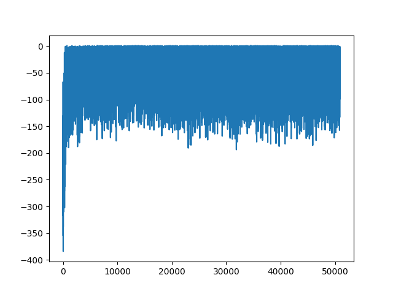
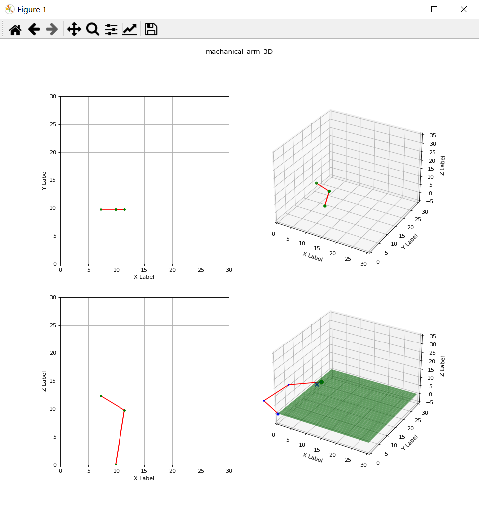

# RL_robot_arm3D
3-dimensional spatial robotic arm control using reinforcement learning algorithms

`If it helps you with your research, please star it. 🎈`

# Requirements and Dependencies
- pytorch 1.9.0
- python 3.6

Training process 
----------

   

Reinforcement learning algorithms
----------
  *PPO

Control interface visualization 
----------

   

